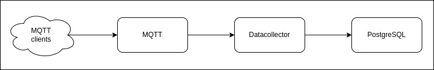

# ODH Datacollector for flightdata

This project provides an [Open Data Hub](https://opendatahub.bz.it/) datacollector to record [MQTT](https://mqtt.org/) messages and to store it in a [PostgreSQL](https://www.postgresql.org/) database.

## Table of Contents

- [General architecture](#general-architecture)
- [Getting started](#getting-started)
  - [Prerequisites](#prerequisites)
  - [Source code](#source-code)
  - [Execute with Docker](#execute-with-docker)
- [Development](#development)
- [FAQ](#faq)
- [Information](#information)

## General architecture

- MQTT: a [mosquitto](https://mosquitto.org/) instance listens for sensor data
- Datacollector: an [Apache Camel](https://camel.apache.org/) instance that listens for data on mosquitto and writes it into PostgreSQL
- Store: [PostgreSQL](https://www.postgresql.org/) instance where data is written to by Apache Camel



## Getting started

These instructions will get you a copy of the project up and running on your local machine for development and testing purposes.

### Prerequisites

To build the projects in the repository, the following prerequisites must be met:

- [Docker](https://www.docker.com/)
- [Docker Compose](https://docs.docker.com/compose/)
- Java JDK 11 or higher (e.g. [OpenJDK](https://openjdk.java.net/)) and [Maven](https://maven.apache.org/) 3.x if you want to build and launch the integration pipeline based on Apache Camel locally (not strictly necessary but nice to have for development)

### Source code

Get a copy of the repository:

```bash
git clone https://github.com/noi-techpark/odh-broker-mqtt.git
```

Change directory:

```bash
cd odh-broker-mqtt/
```

### Execute with Docker

Copy the file `.env.example` to `.env` and adjust the configuration parameters.

```bash
cp env.example .env
```

Start `docker-compose`:

```bash
docker-compose up
```

Docker Compose should now start three containers:

- mosquitto (MQTT)
- postgres (Database)
- datacollector (Apache Camel)

The first launch may take some time, because the Docker images must be pulled and the `datacollector` container has to download all necessary Maven dependencies.

> Note, that you don't have to start mosquitto and postgres from this project together with the datacollector. For example, if you already have a MQTT broker you can connect to and maybe also a PostgreSQL database for storage, you could just start the datacollector using `docker-compose up datacollector`. 

## Development

For development purpose, you can start any of the Docker Compose containers individually, e.g. `docker-compose up mosquitto` starts just mosquitto.

Usually you want to work on the `datacollector`. The datacollector reads from a MQTT broker (mosquitto) and writes to a PostgreSQL database. A common setup for development is therefore to launch mosquitto and PostgreSQL in their respective Docker containers and to start `datacollector` locally. This way you can e.g. easily debug the datacollector. To get the described setup, follow the steps below.

Start `mosquitto` and `postgres` containers using docker-compose:

```bash
docker-compose up mosquitto postgres
```

Run the datacollector locally in dev mode (please note that you need to have Java 11 and Maven 3.x installed):

```bash
mvn compile quarkus:dev
```

This should get you started with development.

> Note that you don't have to start the `datacollector` locally for development. You can start it as container together with the other containers with `docker-compose up` as described in the [Installing](#installing) section. The only drawback is, that it is not that easy to attach a debugger to the datacollector inside the Docker container.

## FAQ

### I get an error `function gen_random_uuid() does not exist` from Flybase migration

The tables defined in this project use UUID values as primary keys. Those keys are auto-generated with the Postgres `gen_random_uuid()` function. If that function does not exist, you'll probably see a `function gen_random_uuid() does not exist` error when you try to start up the datacollector.   

To solve that issue, please use a Postgres version >= 13 or enable the `pgcrypto` extension using the following command:

```sql
CREATE EXTENSION pgcrypto;
```

### What kind of data am I allowed to publish?

The datacollector expects valid JSON to be published. All other kinds of data will not be persisted.

### How can I check if publishing succeeded?

In general, if you want to know if publishing to a topic succeeded, subscribe to that topic. All of your published messages should show up in your subscription.

For topics that need authentication, this is not always true. You may be allowed to subscribe to a topic as anonymous, but due to access control restrictions on that topic you may not see your published messages. You may even not notice that publishing did not succeed when you are not allowed to.

If in doubt, please first double check that you use the correct topic and credentials (where necessary). If you still have troubles, please contact our [support](#support).

### My data seems to not be stored at all. What are possible reasons?

- the message you provide to the MQTT broker is not valid JSON
- you don't have the permission to publish to a certain topic
- The datacollector is not available which you will not detect when you publish a message to MQTT

### How do I publish / subscribe to the MQTT broker?

You can use any MQTT client you want to publish messages to the MQTT broker, e.g. [MQTT Explorer](http://mqtt-explorer.com/) or [MQTTX](https://mqttx.app/). 

You can also use the mosquitto publish / subscribe features provided by mosquitto. Using the Docker version of mosquitto, you can publish a message to topic `/open/test` on localhost using the following command:

```bash
# Publish the message "some" (= valid JSON string) to the topic /open/test using the MQTT instance on localhost
# Please make sure that you correctly escape the double ticks in the message in order to provide valid JSON. 

docker run -it --rm --name mosquitto-pub --network="host" eclipse-mosquitto:2.0.12 sh -c "mosquitto_pub -t '/open/test' -h localhost -m '\"some\"'"
```

Use the following command to subscribe to the topic `/open/test` on localhost:

```bash
# Subscribe to the topic /open/test using the MQTT instance on localhost

docker run -it --rm --name mosquitto-sub --network="host" eclipse-mosquitto:2.0.12 sh -c "mosquitto_sub -t '/open/test' -h localhost"
```

### How can I read the stored data?

You can read the data directly from the PostgreSQL database. 

As a **temporary** alternative, the project provides REST and Websocket endpoints that you can use to read the data. **Please note that those endpoints will be removed in future versions, so don't rely on them or use them in production!**

#### REST endpoints

`/flightdata/sbs`: read stored flightdata

Parameters:

- aggregated, bool, default: FALSE
  - TRUE returns only aggregated data 
  - FALSE returns all data
- ts, number, default: 1635724800000 (= '2021-11-01')
  - set timestamp to return all data since this timestamp
- limit, number, default: 1000, max: 1000
  - set a limit of data records to be retrieved

`/flightdata-scheduled`: read scheduled flightdata from the [Airport Bozen](https://www.bolzanoairport.it/de/)

No parameters

`/swagger`: the [Swagger](https://swagger.io/) definition of the REST endpoints

No parameters

#### Websocket endpoints

`/flightdata/sbs`: raw flightdata

`/flightdata/sbs-aggregated`: aggregated flightdata

## Information

### Support

For support, please contact [info@opendatahub.bz.it](mailto:info@opendatahub.bz.it.

### Contributing

If you'd like to contribute, please follow the following instructions:

- Fork the repository.

- Checkout a topic branch from the `development` branch.

- Make sure the tests are passing.

- Create a pull request against the `development` branch.

A more detailed description can be found here: [https://github.com/noi-techpark/documentation/blob/master/contributors.md](https://github.com/noi-techpark/documentation/blob/master/contributors.md).

### Versioning

This project uses [SemVer](https://semver.org/) for versioning. For the versions available, see the [tags on this repository](https://github.com/noi-techpark/it.bz.opendatahub.databrowser/tags).

### License

The code in this project is licensed under the GNU AFFERO GENERAL PUBLIC LICENSE Version 3 license. See the [LICENSE.md](LICENSE.md) file for more information.

### Authors

- **Christian Gapp** - *Initial work* - [gappc](https://github.com/gappc)
